# cat-reader


Choose your e-book, article or select any text and the reader will speak it out loud, sentence by sentence, while you read it in big ASCII Art letters!

Navigate as you wish, and control everything easily: the speed, the language, the volume of the audio and even the colors!

This is, by far, the most comfortable way to read a book and to be engaged in your favourite readings! You will *read* and *listen to* the text, at the same time, sentence by sentence.

## 🚀 Key Features

`cat-reader` is an acronym for **C Art Text Reader**. It combines the power of C programming with modern text-to-speech technology to give you an artistic reading experience directly in your terminal.

*   **Versatile Input:** Reads almost anything! Supports plain text, and complex formats like `epub`, `markdown`, `docx`, `odt`, `rtf`, `html`, and even text extracted from `pdf` files.
*   **Simultaneous Reading & Listening:** As the text scrolls in big ASCII Art, the sentence is spoken aloud in your chosen language via the integrated Piper TTS engine.
*   **Total Control:** Fine-tune the reading experience with controls for audio speed, volume, language, and visual appearance (colors, bold, dim, highlight).
*   **Seamless Navigation:** Move through the text sentence-by-sentence, or jump large blocks forward or backward using intuitive keyboard shortcuts.
*   **Resource Efficient:** Built in C, ensuring it runs quickly and without hogging your machine resources.

## 🧭 Controls & Shortcuts

When in the immersive Reader mode, these shortcuts allow you to navigate, control playback, and customize the display.

### 📖 Navigation Controls

|      Key      | Action                | Description                     |
| :-----------: | :-------------------- | :------------------------------ |
|   **← / A**   | Move Back (Single)    | Moves to the previous sentence. |
|   **→ / D**   | Move Forward (Single) | Moves to the next sentence.     |
|   **↑ / W**   | Move Forward (Block)  | Jumps forward by 10 sentences.  |
|   **↓ / S**   | Move Back (Block)     | Jumps backward by 10 sentences. |
|  **Page Up**  | Jump Forward (Large)  | Jumps forward by 25 sentences.  |
| **Page Down** | Jump Back (Large)     | Jumps backward by 25 sentences. |

### ⏯️ Playback & Speed Controls

|        Key        | Action         | Description                                       |
| :---------------: | :------------- | :------------------------------------------------ |
|   **Space / P**   | Play / Pause   | Toggles the audio playback.                       |
|    **Q / ESC**    | Quit           | Immediately exits the Reader.                     |
|       **]**       | Increase Speed | Makes the voice speak faster.                     |
|       **[**       | Decrease Speed | Makes the voice speak slower.                     |
|       **{**       | Half Speed     | Sets the playback speed to half.                  |
|       **}**       | Double Speed   | Sets the playback speed to double.                |
| **R / Backspace** | Reset Speed    | Returns the playback speed to the default (1.0x). |
|      **+/-**      | Adjust Volume  | Fine-tunes the speaker volume up or down.         |

### 🎨 Appearance & Customization Controls

|  Key  | Action                  | Description                                                  |
| :---: | :---------------------- | :----------------------------------------------------------- |
| **X** | Change Background Color | Cycles through different background color schemes.           |
| **C** | Next Color Scheme       | Jumps to the next predefined visual theme.                   |
| **Z** | Reset Colors            | Returns the text and background to the default green/dark-blue scheme. |
| **B** | Toggle Bold             | Applies or removes bold formatting.                          |
| **N** | Toggle Dim              | Applies or removes dim formatting.                           |
| **H** | Toggle Highlight        | Applies or removes a highlight effect.                       |
| **L** | Cycle Languages         | Quickly switches the language setting without returning to the main menu. |

## 🤔 Why `cat-reader`?

`cat-reader` stands, as it has told above, for **C Art Text Reader**. It is written in C Language and provides a way to read your *Text* in an *Artistic* way, displaying it in `ASCII Art` big letters! In the image above we can see our little black cat also listening to something, which is the sound of the letters contained in the book, since our reader also "reads for you" the text out loud in the language you select!

For this `text-to-speech` feature, our application uses the `Piper` engine in the background (the new version GPL1) and `SDL2` to play the audio streaming. You don't need to install `piper` or any of its libraries, because they are already embedded in the code and in installed files.

## 🛠️ Requirements & Installation

### Requirements

To compile and run `cat-reader`, you need the following system packages:

*   `gcc`
*   `bash`
*   `make`
*   `pandoc` (For `.markdown`, `.epub`, `.docx`, `.rtf`, `.odt`, `.html`)
*   `poppler-utils` (For text extraction from `.pdf`)
*   `jq` and `newt` (For configuration and selecting options)
*   `json-c` (The external C library for configuration parsing)
*   `SDL2` (External C library for accessing the audio devices. It is needed to play the generated audio streams)

**In Debian or Ubuntu:**

```bash
sudo apt install build-essential bash pandoc poppler-utils jq newt libjson-c-dev libsdl2-dev
```

**In Fedora or CentOS:**

```bash
sudo dnf install gcc make bash pandoc poppler-utils jq newt json-c-devel sdl2-compat-devel
```

### Installation Steps

1.  Clone this repository:

    ```bash
    git clone https://github.com/MorceNOX/cat-reader.git
    ```

2.  Install dependencies (see above).

3.  Build the Binary:

    ```bash
    cd cat-reader
    make -j$(nproc)
    make install-user
    sudo make install
    ```

## 📖 How to Use

Open your terminal and run:

```bash
cat-reader
```

You can intuitively navigate through the main menu, choose your language, configure your voice models, and select your documents or any text to be displayed in big letters and spoken out loud while you read.

Here are some screenshots followed by brief explanations. You can hit the **Help** option at any time in the **main menu** to get help.

### 1. The Main Menu

This is the main menu containing the options to play (read) a file or a selected piece of text, select the language, the voice and the application settings.

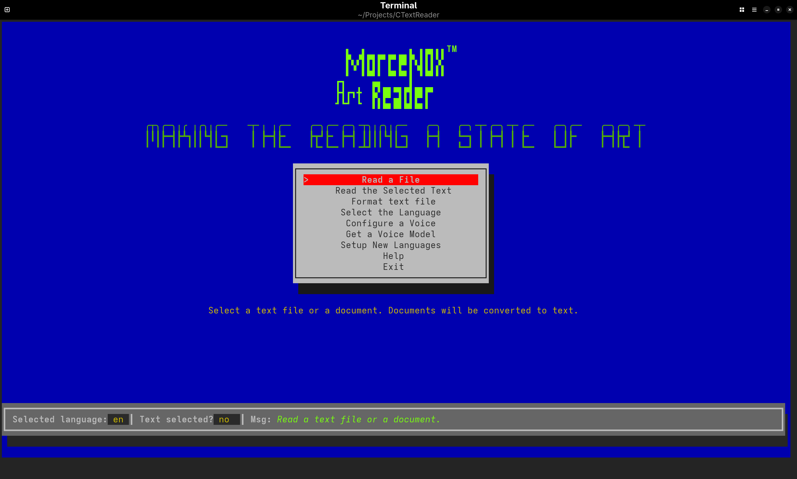

### 2. The Reader Screen

This is **The Reader**, Your terminal dimensions will determine the size and the amount of the text displayed in the screen. The punctuation determines the limits of a sentence.

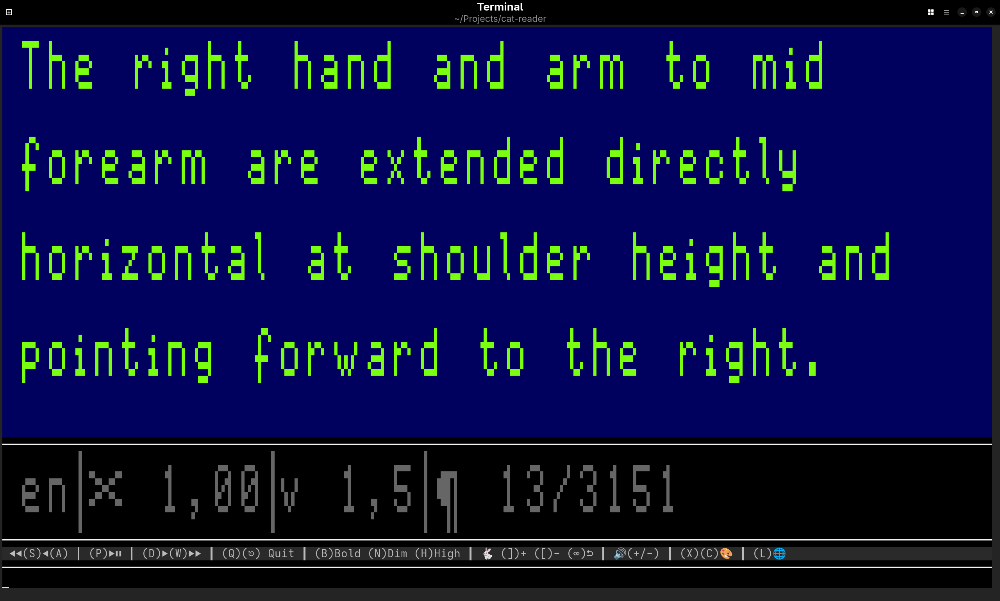

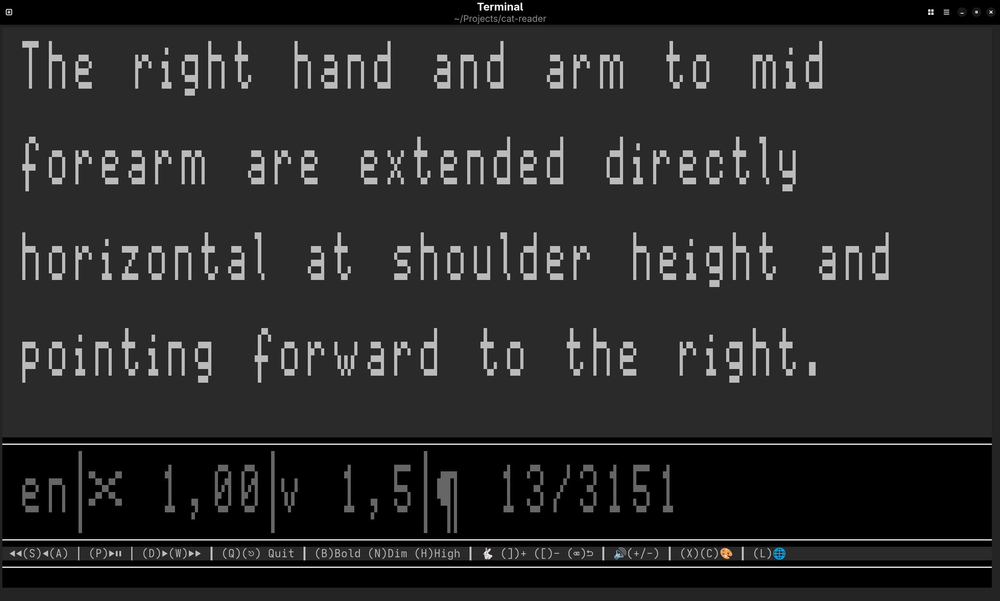

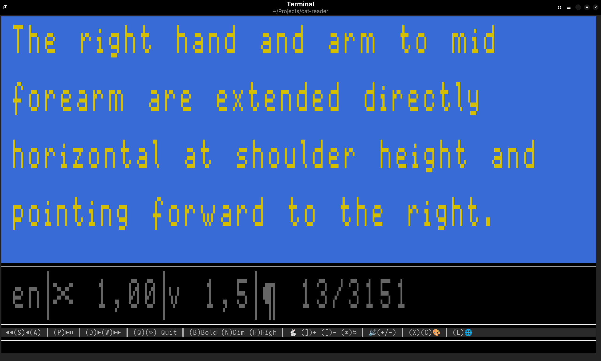

### 3. The File Selector

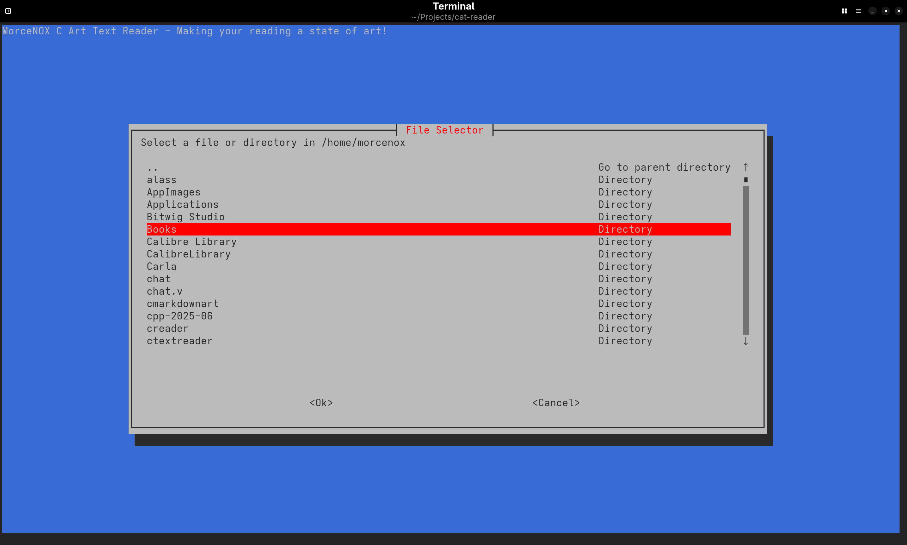

### 4. The Language Selector

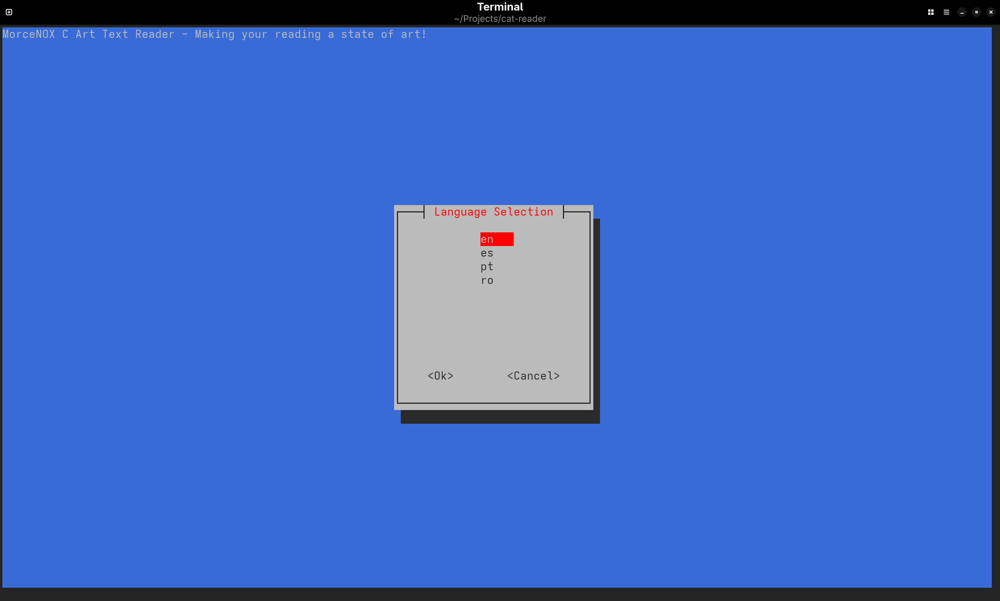

### 5. The Voice Selector

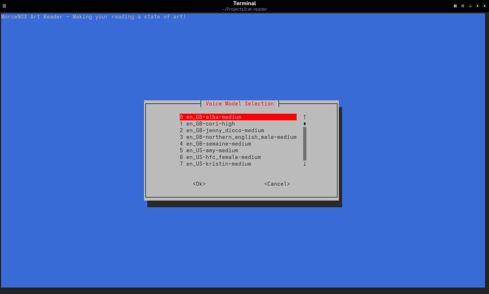

### 6. The Help Screen

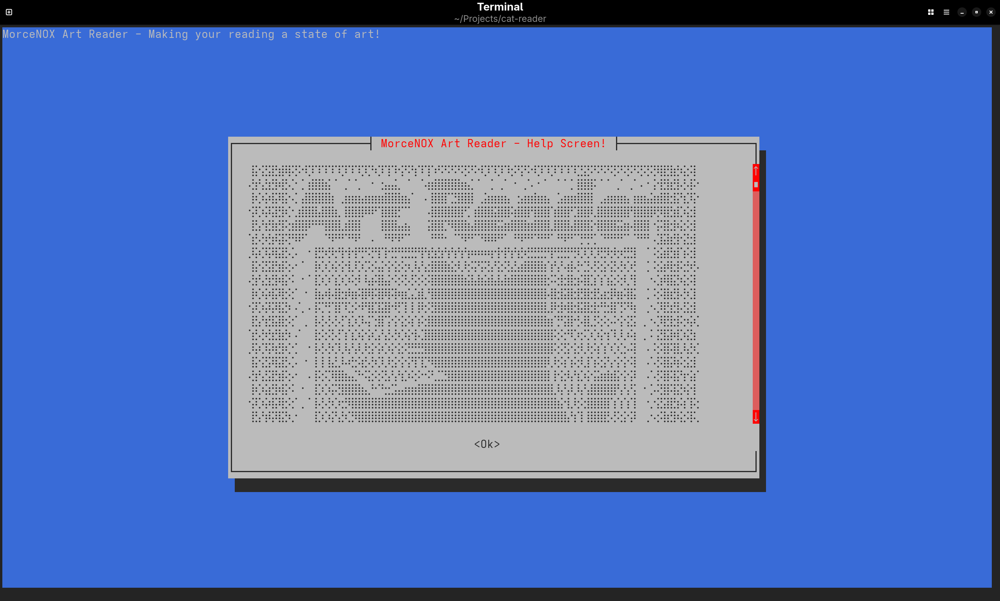

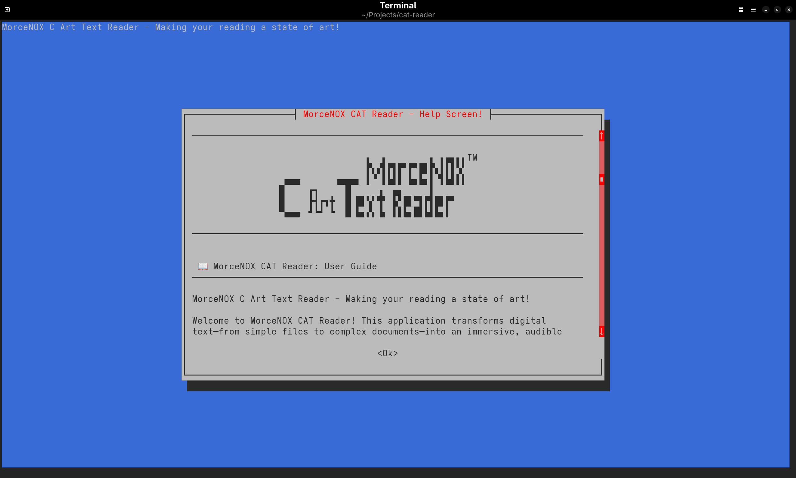

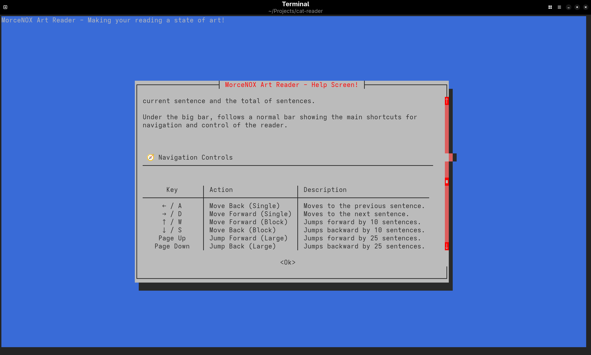

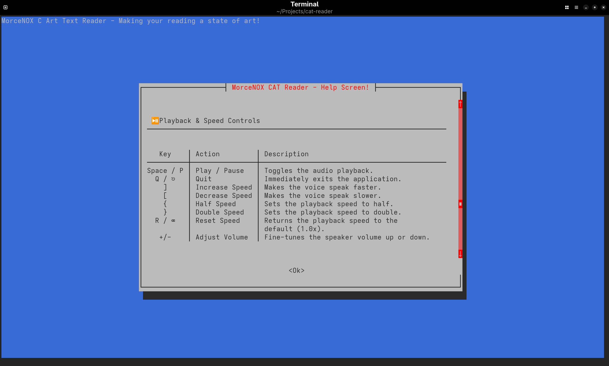

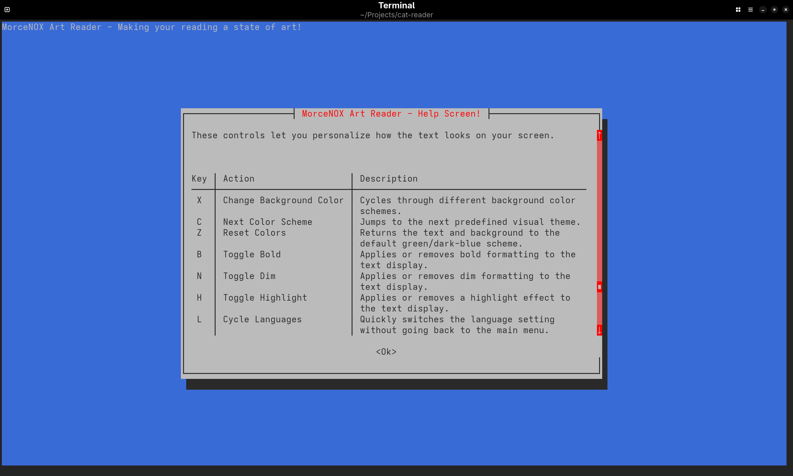

---

## 🤝 Contributing

If you find `cat-reader` useful and want to help improve it, contributions are welcome! Whether it's fixing a bug, refining the ASCII art, or adding support for a new file format, your input helps make this reader better for everyone. Please feel free to fork the repository and submit a pull request.

## 📜 License

This program is free software: you can redistribute it and/or modify it under the terms of the GNU General Public License as published by the Free Software Foundation, either version 3 of the License, or (at your option) any later version.

This program is distributed in the hope that it will be useful, but WITHOUT ANY WARRANTY; without even the implied warranty of MERCHANTABILITY or FITNESS FOR A PARTICULAR PURPOSE. See the GNU General Public License for more details.

You should have received a copy of the GNU General Public License along with this program. If not, see <https://www.gnu.org/licenses/>.